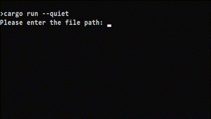

# Plutonium Username Checker ☑️
A simple Rust-based tool to check the availability of usernames on the Plutonium forum. This project quickly verifies whether a username is available or already taken!

## Usage
Below is a demonstration of the tool in action:



## Installation

Follow these steps to set up the project locally:

1. **Clone the repository:**
   
    ```bash
    git clone https://github.com/Yallamaztar/plutonium-name-checker.git
    cd plutonium-name-checker
    ```

2. **Build the project:**
    
   Ensure you have [Rust installed](https://www.rust-lang.org/tools/install) and then run:
   ```bash
   cargo build --release
   ```

3. **Run the Checker:**

    ```bash
    cargo run --release
    ```

---

# Come Play on Brownies SND (T6) 🍰
### Why Brownies? 🤔
- **Stability:** Brownies delivers a consistent, lag-free experience, making it the perfect choice for players who demand uninterrupted action
- **Community:** The players at Brownies are known for being helpful, competitive, and fun—something Orion can only dream of
- **Events & Features:** Brownies is constantly running unique events and offers more server-side customization options than Orion, ensuring every game feels fresh

---

#### [Brownies Discord](https://discord.gg/DtktFBNf5T) | [Brownies IW4M](http://152.53.132.41:1624/) | Made With ❤️ By Budiworld
